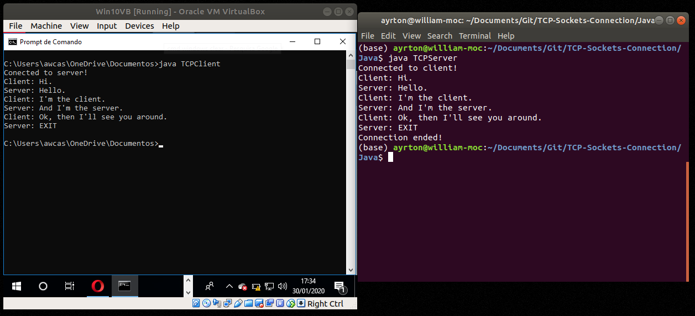

# TCP Sockets Connection

Examples of how to build TCP Sockets connections in Java language.

# About this Project

This project's goal is to build a simple chat application using TCP Sockets Connections in several languages (Java, Python and C++). It is necessary to have two computers in the same network, or a virtual machine configured. One computer will play the server side and the other plays the client side.

**Note:** It is important to run server first, and then run the client. Otherwise, client will never be able to make a connection.

# Getting Started

**Prerequisites**

To run this project, you'll need to have Java installed.

**Installing**

Cloning the Repository

    $ git clone https://github.com/awcasella/TCP-Sockets-Connection.git

    $ cd TCP-Sockets-Connection

# Java

Installing Java

- ORACLE Java installation tutorial can be found [here](https://www.edivaldobrito.com.br/oracle-java-no-ubuntu-18-04-lts/).

Running with Java (on server side):

    $ cd Java
    
    $ javac TCPServer.java
    
    $ java TCPServer
    
Running with Java (on client side):

    $ cd Java
    
    $ javac TCPClient.java
    
    $ java TCPClient

<!---
# Python

Installing Python

    $ pip install tcpsockets

# C++

Installing C++

    $ sudo apt install g++

# References
- Put some
-->
